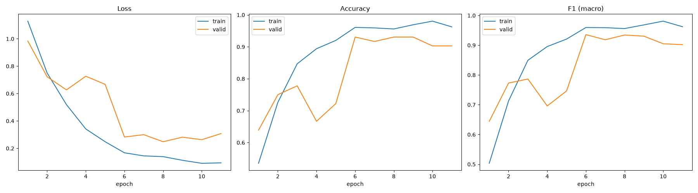
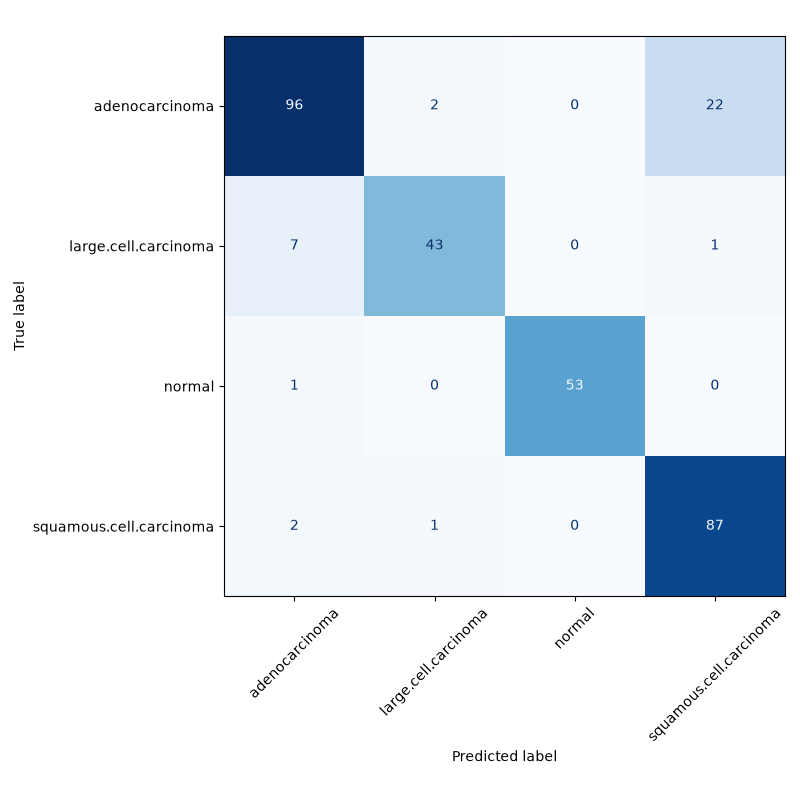

# Lung Cancer Classification — EfficientNet-B0

Fine-tuned **EfficientNet-B0** model that classifies lung CT-scan images into four categories: `adenocarcinoma`, `large.cell.carcinoma`, `normal`, `squamous.cell.carcinoma`.

## Dataset

Trained on the **Lung Cancer 4 Types CT Scan Image Dataset**, published by **Kabil007** on Hugging Face: [huggingface.co/datasets/Kabil007/LungCancer4Types](https://huggingface.co/datasets/Kabil007/LungCancer4Types). This model repository does not redistribute the dataset itself — only the fine-tuned weights, training code, and evaluation results. Please refer to the original Hugging Face dataset page for the data and its license terms.

## Model Description

- **Architecture:** `torchvision.models.efficientnet_b0`, pretrained on ImageNet, with the final classifier layer replaced to output 4 classes.
- **Regularization:** the EfficientNet-B0 classifier head keeps its built-in `Dropout(p=0.2)` before the final linear layer, active throughout fine-tuning to reduce overfitting on the 613-image training set.
- **Input size:** 224x224 RGB, normalized with standard ImageNet mean/std.
- **Augmentation (train only):** random horizontal flip, random rotation (±10°).

## Training Procedure

| Setting | Value |
|---|---|
| Optimizer | Adam |
| Learning rate | 1e-4 |
| Weight decay | 1e-4 |
| Batch size | 16 |
| Max epochs | 20 |
| Early stopping | patience = 5, monitored on validation macro F1 |
| Checkpoint selection | best validation macro F1 |
| Seed | 42 |

Training stopped early at **epoch 11** once validation macro F1 stopped improving. The checkpoint saved corresponds to the best validation macro F1 epoch, not the final epoch — this matters because train loss continued decreasing while validation performance started to plateau, indicating mild overfitting.

### Dataset split

| Split | adenocarcinoma | large.cell.carcinoma | normal | squamous.cell.carcinoma | Total |
|---|---|---|---|---|---|
| train | 195 | 115 | 148 | 155 | 613 |
| valid | 23 | 21 | 13 | 15 | 72 |
| test | 120 | 51 | 54 | 90 | 315 |

## Results (held-out test set, 315 images)

| Class | Precision | Recall | F1-score | Support |
|---|---|---|---|---|
| adenocarcinoma | 0.91 | 0.80 | 0.85 | 120 |
| large.cell.carcinoma | 0.93 | 0.84 | 0.89 | 51 |
| normal | 1.00 | 0.98 | 0.99 | 54 |
| squamous.cell.carcinoma | 0.79 | 0.97 | 0.87 | 90 |

**Accuracy:** 89.0% · **Macro F1:** 0.90 · **Weighted F1:** 0.89

### Training curves



### Confusion matrix



## Known Limitation: adenocarcinoma vs. squamous cell carcinoma

The confusion matrix shows that the model's errors concentrate mostly between `adenocarcinoma` and `squamous.cell.carcinoma`. In particular, 22 adenocarcinoma images were predicted as squamous cell carcinoma, while 2 squamous cell carcinoma images were predicted as adenocarcinoma.

This is the model's main weak spot: `squamous.cell.carcinoma` has high recall, but its precision is lower because a noticeable number of adenocarcinoma samples are pulled into that class. This suggests that the model learns strong features for detecting squamous cell carcinoma, but still struggles to separate it cleanly from adenocarcinoma.

A related effect appears with `large.cell.carcinoma`, which has the smallest training set among cancer classes. Its recall is lower than its precision, meaning the model sometimes misses large cell carcinoma cases and predicts them as another cancer subtype.

**In short:** overall performance is solid, especially for the `normal` class, but the main limitation is the small dataset size and the visual similarity between cancer subtypes. With only 613 training images, the model has limited examples for learning the finer differences between `adenocarcinoma`, `squamous.cell.carcinoma`, and `large.cell.carcinoma`. More labeled training data, especially for the cancer subtype classes, would likely be the highest-leverage improvement.

## How to Use

```python
import torch
import torch.nn as nn
from torchvision.models import efficientnet_b0
from huggingface_hub import hf_hub_download
from PIL import Image
from torchvision import transforms

CLASS_NAMES = ["adenocarcinoma", "large.cell.carcinoma", "normal", "squamous.cell.carcinoma"]

checkpoint_path = hf_hub_download(
    repo_id="yunussgultekiin/lung-cancer-efficientnet-b0",
    filename="model/best_efficientnet_b0.pth",
)

model = efficientnet_b0(weights=None)
model.classifier[1] = nn.Linear(model.classifier[1].in_features, len(CLASS_NAMES))
model.load_state_dict(torch.load(checkpoint_path, map_location="cpu"))
model.eval()

transform = transforms.Compose([
    transforms.Resize((224, 224)),
    transforms.ToTensor(),
    transforms.Normalize(mean=[0.485, 0.456, 0.406], std=[0.229, 0.224, 0.225]),
])

image = Image.open("your_image.png").convert("RGB")
tensor = transform(image).unsqueeze(0)

with torch.no_grad():
    logits = model(tensor)
    predicted_class = CLASS_NAMES[logits.argmax(dim=1).item()]

print(predicted_class)
```

## Intended Use & Limitations

This model is trained for **research and educational purposes only**. It is not a diagnostic tool and has not been validated for clinical use. Predictions should never be used to make or support real medical decisions without review by a qualified pathologist/radiologist.